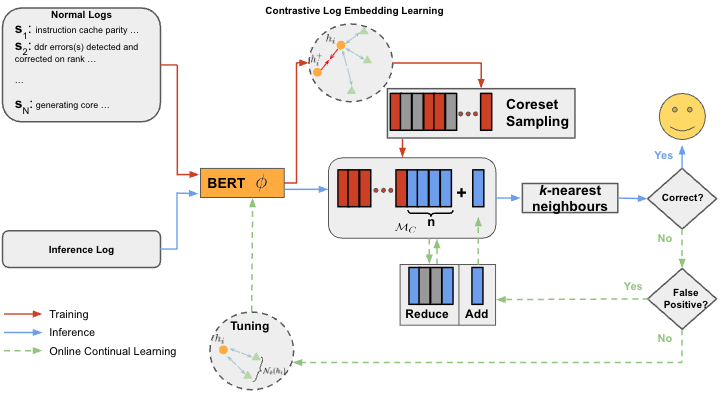

# LogREAD #

[**LogREAD: Log-based Real-time Anomaly Detection Through Online Continual Learning**](https://drive.google.com/file/d/1eJEOcIgjBD7CkGiE_FhOQLfOnfWCBYgg/view?usp=sharing)



## Install dependencies ##
```
pip install -r requirements.txt
```

## Process Log data ##
### BGL, Thunderbird, Spirit or Custom Log data ###
1. set the directory at **./process/[dataset_name].py**
```
indir = '' # where the log files are stored
outdir = '' # where the output .csv file will be stored
```

2. For custom log data, add code for extracting the log labels
```
# Add code for extracting the log labels
labels = ...
```

3. run the processing
```
python -m process.[dataset_name]
```
(Side note: The log parsing called in **data/processor** is only for extracting the labels)


## Run Training + Offline Inference + Online Continual Learning ##
1. set the directory where the processed_log.csv is stored at **main.py**
```
dir_map = {'bgl': '/home/datasets/log_data/BGL/output', 'thunderbird': '/home/datasets/log_data/Thunderbird/output', 'spirit': '/home/datasets/log_data/Spirit/'}
# add custom dataset directory here
# e.g. dir_map['custom'] = 'path/to/custom/dataset'
```

2. 
```
python -m main
```
